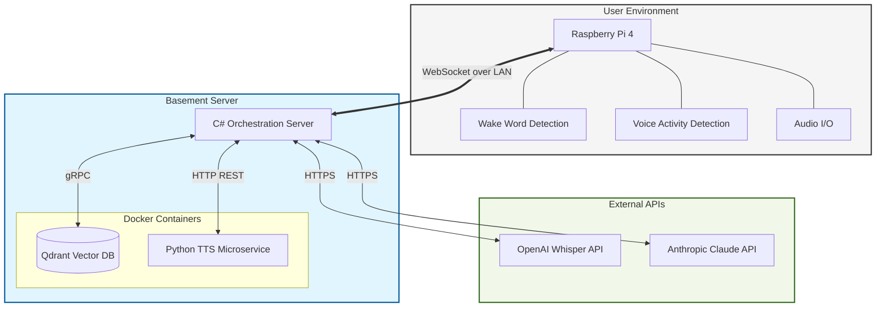

# Blake's Voice Assistant System - Technical Specification Document

**Version:** 1.0  
**Date:** December 2025  
**Author:** Blake Werlinger  
**Status:** Design Phase

---

## Table of Contents

1. [Executive Summary](#executive-summary)
2. [System Architecture Overview](#system-architecture-overview)
3. [Component 1: C# Server Application](#component-1-c-server-application)
4. [Component 2: Python TTS Microservice](#component-2-python-tts-microservice)
5. [Component 3: Raspberry Pi Client](#component-3-raspberry-pi-client)
6. [Data Flow & Communication Protocols](#data-flow--communication-protocols)
7. [Technology Stack Details](#technology-stack-details)
8. [Performance Requirements & Optimization](#performance-requirements--optimization)
9. [Deployment Architecture](#deployment-architecture)
10. [Security Considerations](#security-considerations)
11. [Monitoring & Debugging](#monitoring--debugging)
12. [Future Enhancements](#future-enhancements)

---

## Executive Summary

This document specifies a distributed voice assistant system consisting of three primary software components:

1. **C# Server Application** - Runs on a basement server (i9-9900k, RTX 2070 Super, 64GB RAM), handles AI orchestration, conversation memory, tool execution, and coordinates all system components
2. **Python TTS Microservice** - Runs as a Docker container on the same basement server, provides text-to-speech generation using Chatterbox-Turbo with GPU acceleration
3. **Raspberry Pi Client** - Runs Python on a Raspberry Pi 4, handles audio I/O, wake word detection, and serves as the physical interface point

The system enables natural voice conversations with Claude AI, featuring semantic memory retrieval, tool calling capabilities, and real-time streaming responses with sub-second latency.

---

## System Architecture Overview

### High-Level Architecture



### Component Responsibilities

| Component | Primary Responsibility | Secondary Functions |
|-----------|----------------------|---------------------|
| **Raspberry Pi Client** | Audio I/O interface | Wake word detection, VAD, mic management |
| **C# Server** | AI orchestration & coordination | Memory retrieval, tool execution, streaming pipeline |
| **TTS Microservice** | Speech generation | Voice cloning, audio encoding |
| **Qdrant** | Vector storage | Semantic search, conversation persistence |

### Communication Patterns

1. **Pi ↔ Server**: WebSocket (bidirectional, persistent connection)
2. **Server ↔ TTS**: HTTP REST (request/response per sentence)
3. **Server ↔ Qdrant**: gRPC (vector operations)
4. **Server ↔ External APIs**: HTTPS (Claude, Whisper, OpenAI embeddings)

---

## Component 1: C# Server Application

### Purpose & Responsibilities

The C# server is the brain of the system. It orchestrates all AI interactions, manages conversation state and memory, executes tools, and coordinates between all other components.

### Core Architecture

**Design Pattern:** Clean Architecture with dependency injection

**Layer Structure:**
1. **Presentation Layer** - WebSocket endpoints
2. **Application Layer** - Agent orchestration, prompt building
3. **Domain Layer** - Business logic, tool definitions
4. **Infrastructure Layer** - External API clients, database access

### Key Subsystems

#### 1. WebSocket Server (Port 8080)

**Technology:** ASP.NET Core WebSocket middleware

**Responsibilities:**
- Accept connections from Raspberry Pi clients
- Receive audio chunks from microphone
- Stream audio responses back to Pi
- Handle connection lifecycle (connect, disconnect, error)
- Manage multiple concurrent Pi connections (future scaling)

**Message Protocol:**
```json
// Client → Server (audio chunk)
{
  "type": "audio_chunk",
  "data": "<base64 encoded audio>",
  "timestamp": "2025-12-25T10:30:45Z"
}

// Client → Server (end of speech - triggers immediate transcription)
{
  "type": "end_speech",
  "timestamp": "2025-12-25T10:30:50Z"
}
// Note: The Pi client sends this after detecting ~320ms of silence via Silero VAD.
// The server immediately begins transcription upon receiving this signal,
// eliminating the need for server-side silence detection delays.

// Server → Client (audio response)
{
  "type": "audio_response",
  "data": "<base64 encoded audio>",
  "sentence": "Here's what I found..."
}

// Server → Client (end of response)
{
  "type": "response_complete"
}

// Server → Client (thinking indicator - optional)
{
  "type": "processing",
  "message": "Searching for information..."
}
```

#### 2. Speech-to-Text Service

**Technology:** OpenAI Whisper API

**Responsibilities:**
- Convert received audio chunks to text
- Handle multiple audio formats (WAV, raw PCM)
- Buffer audio until end-of-speech detected

**Configuration:**
- Model: `whisper-1` (default)
- Language: Auto-detect (primarily English)
- Response format: JSON with text + timestamps

**Performance Target:** <500ms for typical 3-5 second audio clip

#### 3. Memory System (RAG)

**Architecture:** Vector-based semantic search with time-weighted ranking

**Components:**

##### 3.1 Embedding Generation
- **Service:** OpenAI Text Embeddings API
- **Model:** `text-embedding-3-small` (1536 dimensions)
- **Alternative:** Local ONNX model (all-MiniLM-L6-v2, 384 dimensions)
- **Input:** User message + Assistant response combined
- **Output:** Float vector [1536]

##### 3.2 Vector Storage
- **Database:** Qdrant (Docker container)
- **Collection Schema:**
  ```
  Collection: "conversations"
  Vector size: 1536
  Distance metric: Cosine similarity
  Index type: HNSW (default)
  ```
- **Payload Structure:**
  ```json
  {
    "user_message": "string",
    "assistant_response": "string",
    "timestamp": "ISO 8601 datetime",
    "session_id": "UUID"
  }
  ```

##### 3.3 Retrieval Strategy

**Phase 1: Oversample**
- Query Qdrant for top 30 semantically similar exchanges
- No time filtering at this stage
- Latency: ~15-20ms (at 100K vectors)

**Phase 2: Time-Weighted Reranking**
- Calculate time decay weight for each result
- Formula: `timeWeight = 1.0 / (1.0 + ageInDays / 30.0)`
- Combine scores: `finalScore = (vectorScore × 0.7) + (timeWeight × 0.3)`
- Sort by final score, return top 10
- Latency: <1ms (client-side)

**Total Memory Retrieval:** ~20-25ms

##### 3.4 Storage Strategy

**When to Store:**
- After each complete assistant response
- Not during tool execution (wait for final response)
- Skip if semantically identical to recent exchange (>95% similarity)

**Data Retention:**
- Default: Keep everything forever
- Storage per exchange: ~6.5KB
- 1M exchanges ≈ 6.5GB
- Cost: Negligible

#### 4. Prompt Factory

**Responsibilities:**
- Build system prompts with dynamic context
- Inject relevant conversation history
- Format tool definitions
- Manage conversation state

**Template Structure:**
```
System Prompt:
├── Static Instructions (role, behavior, constraints)
├── Dynamic Context
│   ├── Current time/day
│   └── User preferences (future)
├── Relevant History (from Qdrant)
│   └── Top 10 semantically relevant past exchanges
├── Available Tools
│   └── Auto-generated from ToolRegistry
└── Response Guidelines
    └── Conciseness, tone, format
```

**Implementation Strategy:**
- Hard-coded template string with placeholder replacement
- No template engine needed (YAGNI principle)
- C# string interpolation for simplicity

#### 5. Agent Orchestration

**Flow:**
1. Receive user message (from STT)
2. Retrieve relevant history (from Qdrant)
3. Build prompt (PromptFactory)
4. Stream Claude API response
5. Handle tool calls (if any)
6. Split response into sentences
7. Generate audio per sentence (TTS service)
8. Stream audio to Pi
9. Store exchange in memory

**Claude API Integration:**
- **SDK:** Anthropic.SDK (C# official client)
- **Model:** claude-sonnet-4-20250514
- **Streaming:** Server-Sent Events (SSE)
- **Max Tokens:** 1000 (configurable)

**Tool Calling Loop:**
```
while response streaming:
    if content_block_delta:
        accumulate text
        detect sentence boundaries
        yield sentences for TTS
    
    if tool_use:
        execute tool via ToolRegistry
        append tool_result to messages
        continue streaming (Claude responds to tool result)
    
    if stop_reason == "end_turn":
        break
```

#### 6. Tool System

**Design Pattern:** Reflection-based auto-registration

**Architecture:**

##### 6.1 Attribute-Based Declaration
```csharp
[Tool("get_weather", "Gets current weather for a location")]
public class WeatherTool
{
    public async Task<WeatherResult> Execute(
        [Parameter("location", "City name")] string location)
    {
        // Implementation
    }
}
```

##### 6.2 ToolRegistry
- Scans assembly for `[Tool]` attributes
- Generates JSON schema from method signatures
- Maintains dictionary of tool name → handler
- Provides tool definitions to Claude API
- Executes tools by name + JSON parameters

##### 6.3 Schema Generation
- C# type → JSON schema type mapping
- Required vs optional parameters
- Description extraction from attributes

**Planned Tools (v1):**
- Weather lookup (OpenWeatherMap API)
- Timer/alarm setting (local)
- Web search (Brave Search API or similar)
- Smart home control (future)

#### 7. TTS Service Integration

**Role:** HTTP client to Python TTS microservice

**Process Flow:**
1. Receive sentence from agent
2. POST to `http://localhost:5000/tts`
3. Receive streaming WAV response
4. Forward to Pi via WebSocket

**Service Management:**
- Spawn Python process on startup
- Health check polling (`/health` endpoint)
- Auto-restart on crash
- Graceful shutdown on server stop

**Error Handling:**
- Retry logic (3 attempts)
- Fallback to queued processing if TTS slow
- Circuit breaker pattern for persistent failures

#### 8. Sentence Splitting

**Purpose:** Break streaming text into speakable units

**Strategy:**
- Simple regex-based splitting: `(?<=[.!?])\s+`
- Buffer incomplete sentences while streaming
- Yield complete sentences immediately
- Handle edge cases (abbreviations, decimals)

**Alternatives Considered:**
- NLP-based parsing (NLTK) - rejected as overkill
- Fixed character chunks - rejected for unnatural breaks
- Clause-level splitting - rejected for complexity

### Technology Stack

| Component | Technology | Version | Justification |
|-----------|-----------|---------|---------------|
| **Runtime** | .NET | 8.0 | Latest LTS, cross-platform, high performance |
| **Language** | C# | 12.0 | Blake's primary language, strong typing, async/await |
| **Web Framework** | ASP.NET Core | 8.0 | Built-in WebSocket support, DI, middleware |
| **DI Container** | Microsoft.Extensions.DependencyInjection | 8.0 | Standard, well-integrated |
| **Configuration** | Microsoft.Extensions.Configuration | 8.0 | JSON-based, environment variables |
| **Logging** | Serilog | 8.0 | Structured logging, multiple sinks |
| **HTTP Client** | HttpClient | Built-in | Reusable, connection pooling |
| **JSON** | System.Text.Json | 8.0 | High performance, built-in |

### External Dependencies

| Service | Purpose | SDK/Library |
|---------|---------|-------------|
| **Claude API** | LLM inference | Anthropic.SDK |
| **OpenAI API** | STT (Whisper), Embeddings | OpenAI |
| **Qdrant** | Vector database | Qdrant.Client (gRPC) |
| **TTS Service** | Speech generation | HTTP client |

### Configuration Management

**File Structure:**
- `appsettings.json` - Default configuration
- `appsettings.Development.json` - Dev overrides
- `appsettings.Production.json` - Production settings
- Environment variables - Secrets (API keys)

**Secret Management:**
- Development: User secrets (`dotnet user-secrets`)
- Production: Environment variables
- Never commit API keys to git

### Performance Targets

| Metric | Target | Notes |
|--------|--------|-------|
| **Time to First Audio** | <1000ms | From speech end to audio start |
| **Memory Retrieval** | <25ms | Qdrant search + reranking |
| **Sentence Processing** | <200ms | TTS generation per sentence |
| **WebSocket Latency** | <10ms | Local network only |
| **Tool Execution** | Varies | Weather: ~500ms, Timer: <10ms |

### Logging Strategy

**Log Levels:**
- **Trace:** Raw data (audio chunks, embeddings)
- **Debug:** Flow details (sentence splits, tool params)
- **Information:** Key events (connection, request, response)
- **Warning:** Recoverable errors (retry, timeout)
- **Error:** Failures (API errors, crashes)
- **Critical:** System failures (startup failure, data loss)

**Log Outputs:**
- Console (structured, human-readable)
- File (JSON, rotating daily, 30-day retention)
- Future: Centralized logging (Seq, Elasticsearch)

---

## Component 2: Python TTS Microservice

### Purpose & Responsibilities

This microservice's sole job is to convert text to speech using Chatterbox-Turbo. It runs in isolation from the main server to:
- Isolate Python dependencies from C# application
- Leverage PyTorch/CUDA for GPU inference
- Allow independent scaling/restart
- Simplify failure recovery

### Architecture

**Pattern:** Stateless HTTP service (FastAPI)

**Process Model:**
- Single-threaded (Chatterbox is GPU-bound, not CPU-bound)
- Model loaded once on startup
- Request queue if multiple simultaneous requests

### API Design

#### Endpoints

**Health Check**
```http
GET /health
Response: {"status": "healthy", "model_loaded": true}
```

**Text-to-Speech**
```http
POST /tts
Content-Type: application/json

Request Body:
{
  "text": "Hello, this is a test.",
  "voice_reference": null,  // Optional: path to reference audio for voice cloning
  "speed": 1.0,              // Optional: speech speed multiplier
  "temperature": 0.7         // Optional: generation temperature
}

Response:
Content-Type: audio/wav
Streaming: Yes
Body: <WAV audio data>
```

### Technology Stack

| Component | Technology | Version | Justification |
|-----------|-----------|---------|---------------|
| **Runtime** | Python | 3.11+ | Chatterbox requirement |
| **Web Framework** | FastAPI | 0.100+ | Async, automatic OpenAPI docs, fast |
| **ASGI Server** | Uvicorn | 0.27+ | Production-ready, ASGI standard |
| **TTS Engine** | Chatterbox-Turbo | Latest | MIT license, 350M params, sub-200ms latency |
| **ML Framework** | PyTorch | 2.0+ | CUDA support required |
| **Audio Library** | torchaudio | 2.0+ | Native PyTorch integration |

### Dependencies

```
# requirements.txt
fastapi==0.100.0
uvicorn[standard]==0.27.0
chatterbox-tts==0.1.0     # Or latest version
torch==2.0.0+cu118        # CUDA 11.8
torchaudio==2.0.0
pydantic==2.0.0
python-multipart==0.0.6
```

### Model Loading Strategy

**Startup Sequence:**
1. Initialize FastAPI app
2. Load Chatterbox-Turbo model to GPU
3. Warm up with dummy inference (avoids first-request latency)
4. Mark service as healthy
5. Begin accepting requests

**Model Caching:**
- Model weights: ~700MB-1GB
- Loaded once, kept in VRAM
- No model switching (single voice/model)

### Audio Processing Pipeline

**Text → Audio Flow:**
```
Input text
    ↓
Tokenization (Chatterbox internal)
    ↓
Semantic token generation (350M param model)
    ↓
Speech-token-to-mel decoder (1-step, distilled)
    ↓
Mel-to-waveform (vocoder)
    ↓
WAV encoding (24kHz, 16-bit, mono)
    ↓
Stream to client
```

**Performance Characteristics:**
- Input: ~20-50 words per sentence
- Generation time: ~50-200ms on RTX 2070 Super
- Output: ~3-5 seconds of audio per sentence
- **Ratio:** Faster than real-time (can generate in <10% of playback time)

### GPU Utilization

**VRAM Allocation (Chatterbox Turbo - 350M params):**
- Model weights: ~2.5GB
- Inference working memory: ~1.5GB
- Total: ~4GB of 8GB available
- Whisper small.en (Q5_0): ~0.7GB
- Combined Whisper + TTS: ~5GB
- Remaining: ~3GB safety margin

**CUDA Optimization:**
- Automatic mixed precision (AMP) if supported
- Tensor cores utilized automatically
- No manual optimization needed (Chatterbox handles it)

### Error Handling

**Failure Scenarios:**
1. **Model load failure** → Crash with clear error (fail-fast)
2. **Generation failure** → Return 500 with error details
3. **CUDA out-of-memory** → Return 503, log for analysis
4. **Invalid input** → Return 400 with validation error

**Health Monitoring:**
- Endpoint returns 200 only if model loaded successfully
- C# server polls health endpoint every 30 seconds
- Auto-restart on repeated health check failures

### Docker Containerization

**Base Image:** `nvidia/cuda:12.1.1-runtime-ubuntu22.04`

**Dockerfile Strategy:**
```dockerfile
FROM nvidia/cuda:12.1.1-runtime-ubuntu22.04

# Install Python
RUN apt-get update && apt-get install -y python3.11 python3-pip

# Install dependencies
COPY requirements.txt .
RUN pip install --no-cache-dir -r requirements.txt

# Copy application
COPY server.py .

# Expose port
EXPOSE 5000

# Run server
CMD ["uvicorn", "server:app", "--host", "0.0.0.0", "--port", "5000"]
```

**Docker Compose Integration:**
```yaml
services:
  tts-service:
    build: ./tts-service
    ports:
      - "5000:5000"
    deploy:
      resources:
        reservations:
          devices:
            - driver: nvidia
              count: 1
              capabilities: [gpu]
    restart: unless-stopped
```

### Configuration

**Environment Variables:**
```bash
TTS_MODEL=chatterbox-turbo        # Model variant
TTS_DEVICE=cuda                   # Device (cuda/cpu)
TTS_PORT=5000                     # Server port
LOG_LEVEL=INFO                    # Logging level
```

### Performance Tuning

**Optimizations:**
1. **Model compilation** - Use `torch.compile()` if PyTorch 2.0+
2. **Batch processing** - Queue multiple requests (future)
3. **Worker processes** - Multiple Uvicorn workers (careful with VRAM)

**Monitoring Metrics:**
- Requests per second
- Average generation time
- GPU utilization %
- VRAM usage
- Queue depth (if batching)

---

## Component 3: Raspberry Pi Client

### Purpose & Responsibilities

The Pi serves as the physical audio interface. It:
- Captures microphone input continuously
- Detects wake word locally
- Streams audio to server when activated
- Receives and plays audio responses
- Manages mic muting during playback

### Architecture

**Pattern:** Event-driven audio pipeline

**Process Flow:**
```
Microphone
    ↓
Audio Buffer (30ms chunks)
    ↓
Wake Word Detection → (if detected) → Activate
    ↓
Voice Activity Detection
    ↓
WebSocket Send (while speech detected)
    ↓
End-of-Speech Detection → Signal server
    ↓
Receive Audio Response
    ↓
Play through Speaker
    ↓
Return to listening
```

### Key Subsystems

#### 1. Audio Capture

**Library:** PyAudio (PortAudio wrapper)

**Configuration:**
- Sample rate: 16kHz (wake word + Whisper requirement)
- Channels: 1 (mono)
- Format: 16-bit PCM
- Chunk size: 480 samples (30ms at 16kHz)

**Hardware:**
- USB microphone (Recommended: Blue Yeti, Samson Meteor)
- Or: Respeaker HAT (better for Pi integration)

**Buffer Management:**
- Ring buffer for continuous capture
- Forward buffer for wake word context

#### 2. Wake Word Detection

**Technology:** OpenWakeWord

**Why OpenWakeWord:**
- Open source, MIT license
- Runs on Pi 4 (CPU inference)
- ~15-25ms latency per chunk
- Custom wake words possible
- Active development

**Alternatives Considered:**
- Porcupine (proprietary, free tier limited)
- Snowboy (deprecated, unmaintained)
- Mycroft Precise (heavier, older)

**Model Selection:**
- Pre-trained: "hey assistant" or similar
- Custom: Train on Blake's voice saying custom phrase
- Threshold: 0.5 (configurable, tune for false positive rate)

**Performance:**
- Latency: ~20ms per 30ms chunk (real-time capable)
- RAM: ~100MB
- CPU: ~15% of Pi 4 single core

#### 3. Voice Activity Detection (VAD)

**Technology:** WebRTC VAD (Python bindings: `webrtcvad`)

**Purpose:**
- Detect start/end of user speech
- Filter out background noise
- Determine when to stop streaming audio

**Configuration:**
- Aggressiveness: 3 (most aggressive, 0-3 scale)
- Frame length: 30ms (matches audio chunk size)

**End-of-Speech Detection:**
- Silence threshold: 1 second (30 consecutive non-speech chunks)
- Adjustable based on user speech patterns

**Performance:**
- Latency: ~2-5ms per chunk
- RAM: ~10MB
- CPU: <5% of Pi 4 single core

#### 4. WebSocket Client

**Library:** `websockets` (Python async library)

**Connection Management:**
- Persistent connection to server
- Auto-reconnect on disconnect
- Exponential backoff on failure
- Heartbeat/ping every 30 seconds

**Message Handling:**
- Async send (audio chunks, end signals)
- Async receive (audio responses, status)
- Binary mode for audio data (more efficient than base64)

**Error Handling:**
- Connection loss → Buffer audio, attempt reconnect
- Server unavailable → Local error sound, retry
- Timeout → Prompt user, abort current interaction

#### 5. Audio Playback

**Library:** PyAudio (same as capture)

**Configuration:**
- Sample rate: 24kHz (Chatterbox output)
- Channels: 1 (mono)
- Format: 16-bit PCM
- Buffer: Streaming (low latency)

**Hardware:**
- USB speaker or 3.5mm output
- Or: Bluetooth speaker (higher latency, not recommended)

**Playback Strategy:**
- Disable microphone during playback (avoid echo loop)
- Stream audio chunks as received (don't wait for full response)
- Resume microphone after playback complete

#### 6. Microphone Management

**Echo Avoidance Strategy (v1):**
```python
def play_response(audio_stream):
    mic.stop_stream()              # Stop microphone
    speaker.start_stream()
    
    for chunk in audio_stream:
        speaker.write(chunk)
    
    speaker.stop_stream()
    mic.start_stream()             # Resume microphone
```

**Future: Interrupt Detection (v2):**
```python
def play_with_interrupts(audio_stream):
    mic.stop_stream()
    vad_listener.start()           # Minimal VAD-only listener
    
    for chunk in audio_stream:
        speaker.write(chunk)
        
        if vad_listener.detected_speech():
            speaker.stop()         # User interrupted
            break
    
    vad_listener.stop()
    mic.start_stream()
```

### Technology Stack

| Component | Technology | Version | Justification |
|-----------|-----------|---------|---------------|
| **Runtime** | Python | 3.11+ | Best Pi support, rich audio libraries |
| **Audio I/O** | PyAudio | 0.2.13 | Industry standard, PortAudio wrapper |
| **Wake Word** | OpenWakeWord | Latest | Fast, accurate, open source |
| **VAD** | webrtcvad | 2.0.10 | Google's VAD, very reliable |
| **WebSocket** | websockets | 12.0+ | Async, well-maintained |
| **Async Runtime** | asyncio | Built-in | Standard Python async |

### Dependencies

```
# requirements.txt
pyaudio==0.2.13
openwakeword==0.5.0
webrtcvad==2.0.10
websockets==12.0
numpy==1.24.0
```

### State Machine

**States:**
1. **IDLE** - Listening for wake word
2. **ACTIVATED** - Wake word detected, starting to listen
3. **LISTENING** - Capturing user speech, streaming to server
4. **PROCESSING** - Server processing, waiting for response
5. **PLAYING** - Playing assistant response
6. **ERROR** - Error state, attempting recovery

**Transitions:**
```
IDLE → (wake word detected) → ACTIVATED
ACTIVATED → (VAD speech start) → LISTENING
LISTENING → (1s silence) → PROCESSING
PROCESSING → (audio received) → PLAYING
PLAYING → (playback complete) → IDLE
* → (error) → ERROR
ERROR → (recovery) → IDLE
```

### Configuration

**config.yaml:**
```yaml
server:
  host: "192.168.1.100"        # Basement server IP
  port: 8080
  reconnect_attempts: 5
  reconnect_delay: 5           # seconds

audio:
  sample_rate: 16000
  chunk_size: 480              # 30ms at 16kHz
  channels: 1
  format: paInt16

wake_word:
  model: "hey_assistant"
  threshold: 0.5
  debounce: 0.5                # seconds

vad:
  aggressiveness: 3
  silence_duration: 1.0        # seconds

playback:
  sample_rate: 24000           # Chatterbox output
```

### Hardware Requirements

| Component | Minimum | Recommended |
|-----------|---------|-------------|
| **Pi Model** | Pi 4 2GB | Pi 4 4GB |
| **Microphone** | Any USB mic | Blue Yeti, Respeaker HAT |
| **Speaker** | 3.5mm/USB | USB powered speaker |
| **Power Supply** | Official 3A | Official 3A |
| **SD Card** | 16GB Class 10 | 32GB Class 10 |

### Performance Targets

| Metric | Target | Actual (Pi 4) |
|--------|--------|---------------|
| **Wake Word Latency** | <50ms | ~20ms |
| **VAD Latency** | <10ms | ~5ms |
| **WebSocket Send** | <10ms | ~5ms (LAN) |
| **Total Added Latency** | <100ms | ~40-50ms |

### Power & Reliability

**Power Management:**
- Disable HDMI (save power)
- Disable Bluetooth if not used
- Disable WiFi if using Ethernet
- CPU governor: ondemand (balance performance/power)

**Reliability:**
- Watchdog timer (auto-reboot on freeze)
- Systemd service (auto-start on boot)
- Log rotation (prevent SD card fill)
- Read-only root filesystem (optional, prevents SD corruption)

### Debugging Tools

**Logging:**
- Structured logs to `/var/log/voice-assistant/`
- Systemd journal integration
- Remote logging to server (optional)

**Audio Monitoring:**
- VU meter display (optional, shows input level)
- Test mode (record and playback without server)
- Wake word confidence logging

**Network Monitoring:**
- Connection status LED (optional)
- Ping monitoring to server
- Bandwidth usage tracking

---

## Data Flow & Communication Protocols

### Complete Interaction Flow

**1. Wake Word Detection (Local on Pi)**
```
Time: T+0ms
Action: User says "Hey Assistant"
Process: OpenWakeWord detects wake phrase locally
Result: Pi enters ACTIVATED state
Latency: ~20ms
```

**2. User Speech Capture (Pi → Server)**
```
Time: T+20ms
Action: User begins speaking request
Process: 
  - Pi captures 30ms audio chunks
  - VAD marks chunks as speech/non-speech
  - Speech chunks sent to server via WebSocket
Result: Audio streaming to server
Latency: ~5-10ms per chunk (network)
```

**3. End-of-Speech Detection (Pi)**
```
Time: T+3000ms (user finishes speaking)
Action: VAD detects 1 second of silence
Process: Pi sends "end_speech" message to server
Result: Server begins processing
Latency: 1000ms (silence threshold)
```

**4. Speech-to-Text (Server)**
```
Time: T+4000ms
Action: Server accumulated audio
Process:
  - Audio forwarded to OpenAI Whisper API
  - Whisper transcribes to text
Result: Text transcript available
Latency: ~200-500ms
```

**5. Memory Retrieval (Server)**
```
Time: T+4500ms
Action: Server has transcript
Process:
  - Generate embedding of user message
  - Query Qdrant for top 30 similar exchanges
  - Rerank with time decay
  - Take top 10
Result: Relevant conversation history retrieved
Latency: ~20-25ms
```

**6. Prompt Building (Server)**
```
Time: T+4525ms
Action: Relevant history retrieved
Process:
  - Build system prompt template
  - Inject current time, history, tools
  - Prepare messages array
Result: Complete request ready for Claude
Latency: <1ms
```

**7. Claude API Streaming (Server → Claude)**
```
Time: T+4526ms
Action: Send request to Claude API
Process:
  - Open SSE connection
  - Stream tokens as they're generated
  - Handle tool calls if needed
Result: Response streaming back
Latency to first token: ~200-500ms
```

**8. Sentence Detection (Server)**
```
Time: T+5000ms (first sentence complete)
Action: Detect sentence boundary in stream
Process:
  - Buffer incoming text
  - Regex match for ". ", "! ", "? "
  - Yield complete sentences
Result: First sentence ready
Latency: <1ms
```

**9. Text-to-Speech (Server → TTS Microservice)**
```
Time: T+5001ms
Action: Send sentence to TTS
Process:
  - HTTP POST to localhost:5000/tts
  - Chatterbox generates audio
  - Stream WAV back
Result: Audio bytes available
Latency: ~50-200ms
```

**10. Audio Streaming (Server → Pi)**
```
Time: T+5200ms
Action: Forward audio to Pi
Process:
  - Send audio chunk via WebSocket
  - Pi receives and buffers
Result: Pi ready to play
Latency: ~5-10ms
```

**11. Audio Playback (Pi)**
```
Time: T+5210ms
Action: Start audio playback
Process:
  - Mute microphone
  - Play audio through speaker
  - Wait for completion
Result: User hears response
Latency: 0ms (immediate playback)
```

**12. Conversation Storage (Server - Async)**
```
Time: After complete response
Action: Store exchange in memory
Process:
  - Combine user + assistant text
  - Generate embedding
  - Store in Qdrant with metadata
Result: Memory updated for future queries
Latency: Not on critical path
```

### Total Latency Breakdown

| Stage | Latency | Cumulative |
|-------|---------|------------|
| Wake word detection | 20ms | 20ms |
| User speech | 3000ms | 3020ms |
| Silence detection | 1000ms | 4020ms |
| STT (Whisper) | 400ms | 4420ms |
| Memory retrieval | 25ms | 4445ms |
| Prompt building | 1ms | 4446ms |
| Claude first token | 350ms | 4796ms |
| Sentence detection | 1ms | 4797ms |
| TTS generation | 150ms | 4947ms |
| Network to Pi | 10ms | 4957ms |
| **Time to First Audio** | | **~950ms** |

**After First Sentence:**
- Pipeline is primed
- Sentences generate while previous plays
- Effective latency: 0ms (continuous speech)

### Network Protocol Details

#### WebSocket Messages (Pi ↔ Server)

**Binary vs Text:**
- Audio data: Binary (raw bytes)
- Control messages: Text (JSON)
- Reason: Binary is more efficient, no base64 overhead

**Frame Size:**
- Audio chunks: 960 bytes (480 samples × 2 bytes)
- Control messages: <1KB
- Response audio: Varies (streaming)

**Bandwidth:**
- Upload (Pi → Server): ~30 KB/s during speech
- Download (Server → Pi): ~60-70 KB/s during playback
- Total: Negligible on modern networks

#### HTTP/REST (Server ↔ TTS)

**Request:**
```http
POST /tts HTTP/1.1
Host: localhost:5000
Content-Type: application/json
Content-Length: 58

{"text": "The weather today is sunny and 72 degrees."}
```

**Response:**
```http
HTTP/1.1 200 OK
Content-Type: audio/wav
Transfer-Encoding: chunked

<WAV file bytes, streamed>
```

**Connection Pooling:**
- Reuse connections (HTTP Keep-Alive)
- Connection limit: 10 concurrent (more than needed)
- Timeout: 30 seconds

#### gRPC (Server ↔ Qdrant)

**Why gRPC:**
- Qdrant's native protocol
- Efficient binary protocol (Protocol Buffers)
- Bidirectional streaming support
- Automatic connection management

**Operations:**
- `Search()`: Vector similarity search
- `Upsert()`: Insert conversation exchanges
- `CreateCollection()`: Initialize on startup
- `ListCollections()`: Check existence

**Performance:**
- Latency: ~5-10ms (localhost)
- Throughput: Not a bottleneck
- Connection: Persistent, multiplexed

---

## Technology Stack Details

### Basement Server Stack

**Operating System:**
- Recommendation: Ubuntu Server 22.04 LTS
- Alternative: Windows 11 (if already installed)
- Reason: Linux preferred for Docker, but Windows works

**Container Runtime:**
- Docker 24.0+
- Docker Compose 2.0+
- NVIDIA Container Toolkit (for GPU access in containers)

**Runtime Environments:**
- .NET 8.0 SDK
- Python 3.11+ (for TTS service)

**Database:**
- Qdrant 1.7+ (Docker container)

### Raspberry Pi Stack

**Operating System:**
- Raspberry Pi OS Lite (64-bit)
- Reason: Headless, minimal overhead

**Audio System:**
- ALSA (Advanced Linux Sound Architecture)
- PulseAudio (optional, if needed for device management)

**Python Environment:**
- Python 3.11+ (via apt or pyenv)
- Virtual environment (venv) for isolation

### External APIs

| Service | Provider | Model/Endpoint | Cost |
|---------|----------|----------------|------|
| **LLM** | Anthropic | claude-sonnet-4-20250514 | ~$3/1M input, ~$15/1M output tokens |
| **STT** | OpenAI | whisper-1 | $0.006/minute |
| **Embeddings** | OpenAI | text-embedding-3-small | $0.02/1M tokens |
| **Weather** | OpenWeatherMap | Free tier | $0 (up to 60 calls/min) |

**Monthly Cost Estimate (Heavy Use):**
- Claude: ~$20-30 (100 conversations/day)
- Whisper: ~$5 (100 × 30 days × avg 2 min)
- Embeddings: <$1 (very cheap)
- **Total: ~$25-35/month**

---

## Performance Requirements & Optimization

### Latency Budgets

**User Perception Thresholds:**
- <100ms: Instantaneous
- 100-300ms: Slight delay, acceptable
- 300-1000ms: Noticeable, still acceptable for AI
- 1000-3000ms: Feels slow, frustrating
- >3000ms: Unacceptable

**Our Targets:**
- Time to First Audio: <1000ms (950ms expected)
- Inter-sentence Gap: <100ms (pipeline primed)
- Tool Execution: Varies (weather ~500ms, timer <10ms)

### Bottleneck Analysis

**Expected Bottlenecks (in order):**
1. **Claude API First Token** (~350ms) - External, can't optimize
2. **Whisper STT** (~400ms) - External, can't optimize
3. **TTS Generation** (~150ms) - Local, already optimized (Turbo model)
4. **Memory Retrieval** (~25ms) - Local, acceptable
5. **Network** (~10-20ms) - LAN, negligible

**Optimization Opportunities:**
1. **Whisper**: Consider local Whisper.cpp (faster, but less accurate)
2. **Claude**: Use Opus instead of Sonnet if speed > quality
3. **TTS**: Already using Turbo (fastest option)
4. **Memory**: Already using oversample + rerank (near-optimal)

### Throughput & Scaling

**Current Design:**
- Single Pi client
- Single TTS instance
- Single C# server instance

**Concurrent Conversation Limit:**
- TTS: 1 at a time (sequential)
- Server: Unlimited (async)
- Qdrant: Thousands per second

**Scaling Path (Future):**
1. Multiple Pis → Single server (works as-is)
2. Multiple TTS requests → Queue or multiple instances
3. Multiple servers → Load balancer (far future)

### Resource Utilization

**Basement Server (Expected):**
- CPU: ~10-20% average (mostly idle, spikes during processing)
- RAM: ~2-4GB (.NET + Qdrant + TTS)
- GPU: ~25-30% (TTS generation only)
- VRAM: ~4GB (Chatterbox Turbo model)
- Network: <1 Mbps
- Disk I/O: Minimal (Qdrant writes)

**Raspberry Pi (Expected):**
- CPU: ~30-40% (wake word + VAD)
- RAM: ~500MB
- Network: <1 Mbps
- Audio I/O: Continuous

---

## Deployment Architecture

### Directory Structure

**Basement Server:**
```
/home/blake/voice-assistant/
├── server/                      # C# application
│   ├── bin/
│   ├── src/
│   ├── appsettings.json
│   └── appsettings.Production.json
├── tts-service/                 # Python TTS
│   ├── server.py
│   ├── requirements.txt
│   └── Dockerfile
├── docker/
│   └── docker-compose.yml
├── logs/
│   ├── server/
│   └── tts/
└── data/
    └── qdrant/                  # Persistent vector data
```

**Raspberry Pi:**
```
/home/blake/voice-client/
├── client.py
├── config.yaml
├── requirements.txt
├── logs/
└── .env                         # Server connection details
```

### Docker Compose Configuration

```yaml
version: '3.8'

services:
  qdrant:
    image: qdrant/qdrant:v1.7.4
    ports:
      - "6333:6333"
    volumes:
      - ./data/qdrant:/qdrant/storage
    restart: unless-stopped

  tts-service:
    build: ./tts-service
    ports:
      - "5000:5000"
    environment:
      - TTS_MODEL=chatterbox-turbo
      - TTS_DEVICE=cuda
    deploy:
      resources:
        reservations:
          devices:
            - driver: nvidia
              count: 1
              capabilities: [gpu]
    restart: unless-stopped
    depends_on:
      - qdrant
```

### Systemd Services

**Basement Server (C#):**
```ini
# /etc/systemd/system/voice-assistant.service
[Unit]
Description=Blake's Voice Assistant Server
After=network.target docker.service
Requires=docker.service

[Service]
Type=simple
User=blake
WorkingDirectory=/home/blake/voice-assistant/server
ExecStart=/usr/bin/dotnet run --configuration Release
Restart=always
RestartSec=10

[Install]
WantedBy=multi-user.target
```

**Raspberry Pi Client:**
```ini
# /etc/systemd/system/voice-client.service
[Unit]
Description=Voice Assistant Client
After=network-online.target sound.target
Wants=network-online.target

[Service]
Type=simple
User=pi
WorkingDirectory=/home/blake/voice-client
ExecStart=/home/blake/voice-client/venv/bin/python client.py
Restart=always
RestartSec=10
Environment="PYTHONUNBUFFERED=1"

[Install]
WantedBy=multi-user.target
```

### Startup Sequence

**Basement Server:**
1. Boot OS
2. Docker daemon starts
3. Docker Compose up (Qdrant, TTS)
4. Wait for services healthy
5. Start C# server
6. Initialize Qdrant collection (if needed)
7. Spawn TTS process
8. Health check TTS
9. Start WebSocket server
10. Ready for connections

**Raspberry Pi:**
1. Boot OS
2. Wait for network
3. Load audio devices
4. Start voice client service
5. Connect to basement server
6. Initialize wake word model
7. Begin listening

### Backup & Recovery

**What to Backup:**
- Qdrant data (`/data/qdrant/`) - Conversation history
- Server configuration (`appsettings.Production.json`)
- Pi configuration (`config.yaml`)

**Backup Strategy:**
- Daily: Automated backup to NAS/cloud
- Retention: 30 days
- Restoration: Documented procedure

**Disaster Recovery:**
- Total data loss: Start fresh (conversations lost)
- Qdrant corruption: Restore from backup
- Server failure: Redeploy on new hardware
- Pi SD card failure: Reflash, restore config

---

## Security Considerations

### API Key Management

**Storage:**
- **Never** commit to git
- Development: User secrets
- Production: Environment variables or key vault

**Rotation:**
- Claude API key: Rotate every 90 days
- OpenAI API key: Rotate every 90 days
- Store old keys for 7 days (rollback period)

### Network Security

**Firewall Rules (Basement Server):**
- Port 8080: Allow from Pi's IP only
- Port 5000: Localhost only (TTS)
- Port 6333: Localhost only (Qdrant)
- All other ports: Deny

**Pi Security:**
- SSH: Key-based auth only, disable password
- Firewall: Allow outbound to server only
- No exposed ports

### Data Privacy

**Conversation Storage:**
- All data stored locally (basement server)
- No cloud backup by default (user choice)
- Qdrant data is unencrypted (single-user system)

**API Data:**
- OpenAI: Audio sent to Whisper API (retained 30 days)
- Anthropic: Text sent to Claude API (not used for training)
- Consider: Self-hosted Whisper for full privacy

### Attack Vectors

**Risk:** Unauthorized access to Pi
- **Mitigation:** SSH key auth, firewall, physical security

**Risk:** Network eavesdropping
- **Mitigation:** Encrypted WebSocket (WSS) - future
- Current: LAN only, trusted network

**Risk:** API key theft
- **Mitigation:** Environment variables, file permissions

**Risk:** Prompt injection via audio
- **Mitigation:** Claude's built-in protections, input validation

---

## Monitoring & Debugging

### Logging Strategy

**C# Server Logs:**
```
/home/blake/voice-assistant/logs/server/
├── voice-assistant-20251225.log      # Daily rotation
├── voice-assistant-20251226.log
└── errors-20251225.log               # Error-only log
```

**TTS Service Logs:**
- Docker logs: `docker logs tts-service`
- Persistent: Bind mount volume for logs

**Pi Client Logs:**
```
/home/blake/voice-client/logs/
├── client-20251225.log
└── audio-debug-20251225.wav          # Optional: record audio for debugging
```

### Metrics to Track

**Server:**
- WebSocket connections (active/total)
- Requests per minute
- Average latency (STT, LLM, TTS, total)
- Memory retrieval time
- Tool execution frequency
- Error rate by type

**TTS Service:**
- Requests per minute
- Average generation time
- GPU utilization
- VRAM usage
- Queue depth

**Pi:**
- Wake word detections
- False positive rate
- Audio chunk send rate
- Connection uptime
- CPU/RAM usage

### Debugging Tools

**Server:**
- Serilog structured logs (grep-able, JSON)
- Health check endpoints
- Manual test mode (curl commands)

**TTS:**
- FastAPI auto-docs (`/docs`)
- Manual generation test
- CUDA diagnostics

**Pi:**
- Audio loopback test (record & playback)
- Wake word sensitivity tuning
- Network ping test
- Simulated server responses

### Common Issues & Solutions

| Symptom | Likely Cause | Solution |
|---------|--------------|----------|
| No wake word detection | Threshold too high, mic issue | Adjust threshold, check mic levels |
| High latency | Network, API slow, TTS overloaded | Check network, monitor API, check GPU |
| Echo/feedback | Mic not muted during playback | Verify mute logic, add AEC |
| Connection drops | Network unstable, server crash | Check logs, implement reconnect backoff |
| TTS fails | CUDA OOM, model load error | Check VRAM, restart service |
| Memory not working | Qdrant down, embedding failure | Check Qdrant health, API key |

---

## Future Enhancements

### Phase 2 Features

**1. Interrupt Detection**
- Implement AEC (Acoustic Echo Cancellation)
- Allow user to interrupt mid-response
- Requires: Speex or WebRTC audio processing

**2. Multi-User Support**
- Voice fingerprinting
- Per-user memory/preferences
- User switching via voice command

**3. Context Awareness**
- Calendar integration (upcoming events)
- Location awareness (home vs away)
- Time-of-day behaviors (morning vs evening)

**4. Advanced Tools**
- Smart home control (Hue, Nest, etc.)
- Email/calendar management
- Task management (Todoist, etc.)
- Music control (Spotify, etc.)

### Phase 3 Features

**1. Local Whisper**
- Self-hosted STT (whisper.cpp)
- Faster, more private
- Requires: CPU optimization or GPU sharing

**2. Custom Voice**
- Train Chatterbox on Blake's voice
- Personalized assistant voice
- Requires: 10-20 minutes of voice samples

**3. Conversation Summarization**
- Daily/weekly summaries
- Topic extraction
- Trend analysis

**4. Mobile App**
- iOS/Android client
- Same backend, different frontend
- Voice assistant anywhere

### Technical Debt to Address

**1. Error Handling**
- More graceful degradation
- Better retry logic
- User-friendly error messages

**2. Testing**
- Unit tests (C# services)
- Integration tests (full pipeline)
- Load testing (concurrent users)

**3. Documentation**
- Code comments
- API documentation
- Deployment runbook

**4. Performance**
- Profile and optimize hot paths
- Reduce cold start time
- Cache frequently used data

---

## Appendix: Quick Reference

### Port Mapping

| Service | Port | Access |
|---------|------|--------|
| WebSocket Server | 8080 | Pi → Server |
| TTS Service | 5000 | Server (localhost only) |
| Qdrant | 6333 | Server (localhost only) |

### Environment Variables

**C# Server:**
```bash
ANTHROPIC_API_KEY=sk-ant-...
OPENAI_API_KEY=sk-...
ASPNETCORE_ENVIRONMENT=Production
```

**Python TTS:**
```bash
TTS_MODEL=chatterbox-turbo
TTS_DEVICE=cuda
TTS_PORT=5000
```

**Pi Client:**
```bash
SERVER_HOST=192.168.1.100
SERVER_PORT=8080
```

### Key Commands

**Server:**
```bash
# Start all services
cd /home/blake/voice-assistant
docker-compose up -d
dotnet run --project server --configuration Release

# View logs
tail -f logs/server/voice-assistant-*.log
docker logs -f tts-service

# Restart TTS
docker-compose restart tts-service
```

**Pi:**
```bash
# Start client
cd /home/blake/voice-client
source venv/bin/activate
python client.py

# View logs
tail -f logs/client-*.log

# Test audio
arecord -d 5 test.wav
aplay test.wav
```

### Troubleshooting Checklist

- [ ] Network connectivity (ping server from Pi)
- [ ] Docker services running (`docker ps`)
- [ ] Qdrant healthy (`curl localhost:6333/health`)
- [ ] TTS healthy (`curl localhost:5000/health`)
- [ ] C# server logs (check for errors)
- [ ] API keys valid (check error messages)
- [ ] Audio devices detected (`arecord -l`, `aplay -l`)
- [ ] Disk space available (`df -h`)
- [ ] GPU available (`nvidia-smi`)

---

**End of Document**

This specification provides a comprehensive technical overview of the three-component voice assistant system. Each component is designed to be modular, maintainable, and scalable, with clear interfaces and well-defined responsibilities.